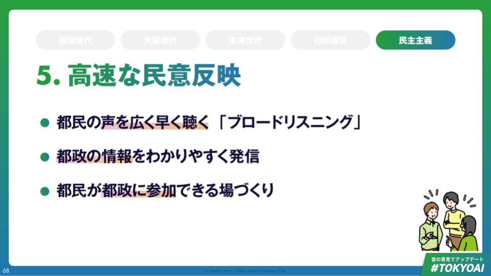

# 【民主主義】高速な民意反映

## より良い都政を、皆さんとともに

- 現状認識・課題認識
    - 声を届けたいという都民の意思に対して、十分に対応できる仕組みが整っていない
    - デジタルを活用することで、広く・早く都民の声を集め、民意を都政に反映していけないだろうか
- マニフェスト
    - 都民の声を広く・早く聴く「ブロードリスニング」
    - 都の情報・都政の情報をわかりやすく発信する
    - 都民同士が意見を交わし、都政の意思決定に参加できる場を作る

## 都民の声は、もっと都政に活かせる

- 都政への要望のトップは3年連続で「都民の意見や要望をよく知る」
    - <https://www.metro.tokyo.lg.jp/tosei/hodohappyo/press/2024/01/26/documents/01_01.pdf>
    - 東京都政策企画局が実施した「都民生活に関する世論調査（令和６年１月）において、これからの都政の進め方に対して特に望むことという問いへの回答は、「都民の意見や要望をよく知る」が3年連続1位かつ増加傾向であった
- 多様化する社会の中で、最も都民の想いを理解しているのは都民自身である。現場に近い声を吸い上げなければ適切なビジョンもプランも作成できない

## しかし、現状のやり方では限界がある

- 人口1400万人超の日本最大の自治体で、既存のやり方で一人ひとりの声を適切に聴くのは、マンパワーの限界である
    - 現状都民が都政に要望を届けるルートとしては、メールが最も多いが、電話・FAX・郵送なども根強いルート
        - 令和4年度年次報告　都政への提言、意見、要望等の状況という調査では、令和4年度の都民の声受付件数としてはメールが29768件、電話が15236件、ファクシミリが940件、郵送が803件、来訪等が178件という内訳だった
        - <https://www.metro.tokyo.lg.jp/tosei/hodohappyo/press/2023/09/15/documents/01_01.pdf>
- 特に音声でのコミュニケーションは話し手の時間と聞き手の時間を同量消費するので、都民より人数の少ない都職員が「声」を広く聞くのは物理的に不可能である

## ①都民の声を広く・早く聴く「ブロードリスニング」

- 都から情報を広く知らしめる「ブロードキャスト」だけでなく、都民の声を広く聴く「ブロードリスニング」をテクノロジーの力で実現する
- 集める声の広さを担保すべく、既存の「都政への要望・提言」手段に加え、意見表明のハードルをより下げるような新手段を提案する
    - LINEの活用、「東京アプリ」の開発など
- 集まった声は技術を活用しわかりやすくレポート化し公開する。都議会において政策検討に活かすのはもちろん、都民自身が都政を知り考える材料とすることが可能になる

## 「ブロードキャスト」ではなく「ブロードリスニング」を

- 一人の声を多数へ発信するブロードキャストだけではなく、多くの声を上手に収集するブロードリスニングが必要
    - 既存の意見募集は、多数の意見をそのまま聴くため、受け取り側がパンクする
    - [https://scrapbox.io/nishio/ブロードリスニング](https://scrapbox.io/nishio/%E3%83%96%E3%83%AD%E3%83%BC%E3%83%89%E3%83%AA%E3%82%B9%E3%83%8B%E3%83%B3%E3%82%B0)
- テクノロジーを使って、「発信」だけでなく「受信」をアップデート

## 意見表明のハードルを下げる新手段を提案

- LINEやスマホアプリなど日常に溶け込んだツールを活用
    - LINEを送るだけ・アプリでのプッシュ通知に答えるだけ・SNSにつぶやくだけなど、現行手段よりもデジタル世代が手軽に利用できるチャネルを拡充する
- 意見表明を習慣化できる仕掛けづくり
    - 不定期に開催されているパブリックコメントについて、毎月定例の枠を用意し、意見表明を習慣化する
    - 日頃都政に対しての課題を考える時間がなく、言語化できていない都民の方に対しても、都から論点を提示しプッシュ型でお聞きすることで、意見表明を促す
- 既存手段にデジタルを掛け合わせ、より利便性を向上
    - 公共施設等にタブレットを設置、職員＋AIアシスタントにより、その場で音声で意見を伝えられる仕組み
    - 電話でAIアシスタントが意見を聴取、電子データ化し分析
    - 今回のデジタル化でねん出された都職員の工数を、地域への出張聞き取りへ。AIアシスタントを帯同し、各地域の集会所等でヒアリングを定期的に実施、データを広く収集

## 集まった声をわかりやすく公開

- 声を集めるだけでなく、如何に都政に活かせる形に加工し活用するかがカギ
    - 集めた声は、テクノロジーを使ってわかりやすい形式に編集
        - 似た意見同士をグループ化
        - 主な意見を要約し、短時間でも理解しやすく
    - プライバシーに配慮した形で、可能な限り全ての声を公開
        - 「みんなの声」を見る権利は「みんな」にある
        - 都民とともに考える都政へ
- 実際に本選挙期間において安野の出馬に関する人々の意見をレポート化し公開
- AIによる「要約」により誰もが全体像を理解しやすい形の情報発信を

## ②都政の情報をわかりやすく発信する

- 現行の取り組みで政策の進捗などが見える化されつつあるが、いまだに都民の皆様からの「もっと情報発信してほしい」のニーズは根強い
- 政策の結果だけでなく、議論過程も透明化するため、都議会の議事録などを技術を用いて加工しわかりやすく発信していく
- 「都議会AI」を作成。都民の皆様がテキストや音声で質問をすることで、気軽にご自身の知りたい内容を把握できるような仕組みを作る

## 「もっと情報発信してほしい」というニーズは今も根強い

- 東京都政策企画局が実施した「都民生活に関する世論調査（令和６年１月）において、これからの都政の進め方に対して特に望むことという問いへの回答は、令和5年の調査で３５．４％が「都政情報をわかりやすく提供する」、また２７．６％が「情報公開を積極的に進める」と回答。全体の3位と4位にランクインした
    - <https://www.metro.tokyo.lg.jp/tosei/hodohappyo/press/2024/01/26/documents/01_01.pdf>
- ここ数年で情報公開については大きな前進は見られるものの、まだまだ歩みを止めてはいけない

## 都議会議事録などをわかりやすく発信し議論過程も透明化

- 政策の成果の見える化を各種進めている点は、継続
    - 政策ダッシュボードなどの取り組みは評価できる
- 議論過程も透明化すべく、都議会議事録などをわかりやすく加工し発進
    - 今回の選挙キャンペーンでも実験的にレポートを公開している

## 「都議会AI」を作成し、都民が気軽に質問できる環境を

- 大量の情報がただ公開され続けるだけでは都民にとってわかりやすいとは言えない。例えば以下のようなニーズが起きうる
    - たくさん公開されても困る、興味があるところだけまずは知りたい
    - 専門用語がピンとこない、誰かにわかりやすく解説してほしい
- 都議会の議論内容を学習させたAIを作成し、24時間都民からの質問に答え、都政の今を伝える仕組みを構築する

## ③都民が都政に参加できる場づくり

- 都民参加型予算編成や、都民からの政策提案・意見収集を受け付けられる「都政参加プラットフォーム」を構築する
- 現行の各種政治参加の取り組みの課題である「参加率の低迷」の打破のため、周知活動を行ったり、参加方法の幅を広げる

## 都民向け「都政参加プラットフォーム」を構築・活性化する

- 都民参加型予算編成
    - 世界3,000以上の都市で実施されている「参加型予算編成」を東京で本格展開。現在の「都民提案」を改善していく
    - Quadratic Votingなど必要な仕組みを取り入れ、納得感をあげていく
- 都民による政策提案
    - 様々なイシューに対し、選挙期間に限らず都民が自由に政策提案できるプラットフォームを
    - 都民からの賛同を一定得たものは、都議会での議題に挙げる
- 都民による政策議論
    - 都議会の論点に対して、都民からも広く意見を募集
    - 公的な情報発信を担うWEBサイトやアプリに意見投稿の導線を追加し、気になったことをその場でフィードバックできるようにする
    - どういった意見があるのかを可視化し、閉じた議会の中だけでは得られない視点を取り込んでよりよい政策決定へ

## 政治参加の課題である「参加率の低迷」を打破する

- 現行日本で行われている参加型予算編成はいずれも参加率が低いことが問題視されている
    - 三重県では、投票数の少なさから「少ない民意で税金の使い道を定めてよいのか」と異議が申し立てられ中止になったことも
    - 東京都が現在行っている参加型予算編成も、人口1400万人に対して投票数は数万票程度と参加率は低い
- 参加率の低迷の原因と考えられる「認知度の低さ」「興味のなさ」「参加するハードルの高さ」について打ち手を打つ
    - 認知度向上のための周知活動
    - 政治への興味が高まるタイミングでの抱き合わせ実施
    - イベント性を持たせる。ビジネスコンテスト化、ハッカソン化する
    - 様々な手法を使い、「参加を待つ」ではなく「都民の元に参加の場所を届ける」意識
        - アプリからプッシュ通知
        - 地域出張所で対面での参加の場を複数設ける
    - 公共施設に専用端末を設置し、端末を持たない人も参加を促す
    - 事業提案を気軽にできる広報を行う。政治の専門知識がなくとも、身近に感じる課題から気軽に提案を挙げてもらう
- 人間の苦手をデジタルで補い、より広く・早い民意反映で、東京都をアップデートする
    - 少子高齢化の加速する日本・東京において、「今までと同じやり方」では現状維持も難しい。人の弱点を補い・負担を軽減するデジタル活用で、よりよい都政を実現する
