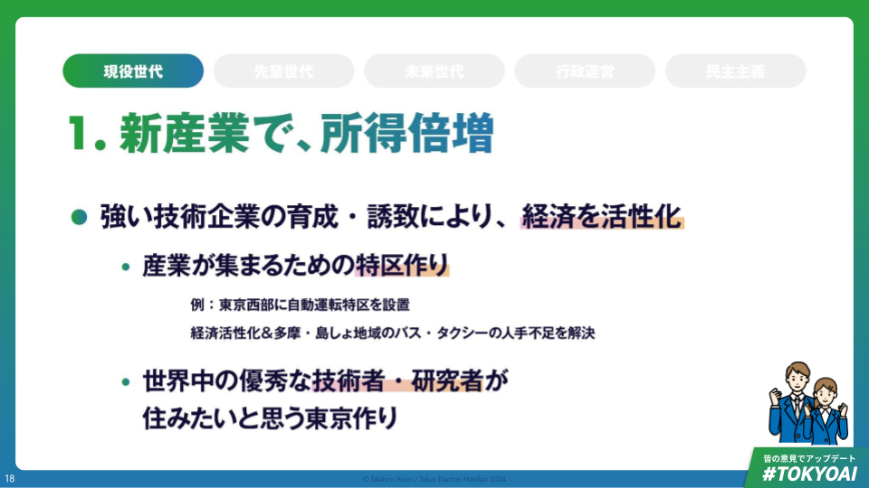

# 【現役世代】新産業で所得爆増

## 強い技術企業の育成・誘致により、都民の所得倍増

- 現状認識・課題意識
    - 経済成長のドライバーは
        - ①人口増加、
        - ②天然資源の活用、
        - ③テクノロジー
    - と言われているが、①と②は日本では望みづらい
    - 日本・東京の経済成長は技術産業にかかっているといっても過言ではなく、加えて、特定産業への選択と集中は、国ではやりづらいが、都ならできる
    - 一方で現状、強い技術企業の発展に繋がる人材・産業を「集め、育てる」ことに課題あり
- マニフェスト
    - 強い技術企業の育成・誘致による経済活性化・所得倍増のため、以下を行う
        - **産業が集まるための特区作り**
            - 例）東京西部に自動運転特区を設置し経済活性化&多摩・島しょ地域のバス・タクシーの人手不足を解決
        - **世界中から優秀な技術者・研究者が住みたいと思う東京作り**

## 世界の時価総額ランキングの上位は、技術企業が占めている

- 時価総額ランキングの変遷を見ると、2005年時点での時価総額世界トップ10の企業のうち技術企業は4社だったが、2024年時点ではトップ10のうち8社が技術企業である

|      | 2005年                      | 2024年                      |
| ---- | --------------------------- | --------------------------- |
| 1    | US ゼネラル・エレクトリック | US アップル                 |
| 2    | US エクソンモービル         | US マイクロソフト           |
| 3    | US マイクロソフト           | SA サウジ・アラムコ         |
| 4    | US シティグループ           | US アルファベット           |
| 5    | GB BP                       | US アマゾン                 |
| 6    | GB ロイヤル・ダッチ・シェル | US エヌビディア             |
| 7    | US P&G                      | US メタ                     |
| 8    | US ウォルマート             | US バークシャー・ハサウェイ |
| 9    | JP トヨタ自動車             | US テスラ                   |
| 10   | US バンク・オブ・アメリカ   | US イーライリリー           |

## 強い技術企業の育成・誘致できると、経済が活性化し所得水準が向上

- 強い技術企業の育成・誘致が所得向上に繋がった事例
    - 自動車産業...世界有数の大企業であるトヨタの本社周辺には「企業城下町」と呼ばれる都市が形成されている。
    - ソフトウェア産業...米西海岸のベイエリアやインドのバンガロールには大学・研究機関が集積していたため、強い技術企業が拠点を置いたことで新しい街が生まれた。
    - 半導体産業...熊本県では半導体工場誘致に伴い、人口流入が顕著。TSMC直雇用は2000人程度だが、暮らしを支える産業が登場することでそのほかにもたくさんの雇用が生まれ経済効果も出ている。

## 技術企業が集まると、既存産業のさらなる発展にも繋がる

- 例えばAIの技術発展に伴い、多くの既存産業が発展を遂げた
    - モビリティ産業での自動運転の実現
    - サービス産業での多言語対応・自動化の実現
    - 教育産業でのAIチューターの実現
    - 一次産業では農業の効率化の実現
    - 不動産産業ではバックグラウンドチェックの進化
    - 防災産業では避難所の情報収集の高度化
    - 医療では医師の需給最適化
    - 伝統工芸品では技術継承や海外進出の推進
- 逆にいうと、東京（日本）にAIスタートアップが増えないと、日本で使いにくいモデルやサービスが今後量産されてしまう

## 強い技術企業が東京に集まるポテンシャルは、すでにある

- 学術都市として東京の魅力
    - 世界の都市総合力ランキングで「研究・開発」部門4位にランキング
    - 東京は働きたい都市
        - Google等のエンジニアにも東京オフィスで働くことは人気
- AIに親和的な法規制・文化
    - 「AIを使った製品とサービスには欠点よりも恩恵がある」の質問に対して、日本は42%が「そう思う」と回答。イギリス38%、ドイツが37%、アメリカ35%、カナダ32%、フランス31%。
- 地政学観点
    - アジア太平洋地域において、東京が近年より重視されつつある
        - 日本は東アジア地域の中で比較的地政学的リスクが低い
        - 日本の円安
- OpenAI、Microsoft Research、SakanaAIなど、強い技術企業の拠点が東京に置かれ始めている

## 「集め、育てる」機能をさらに伸ばす必要

- 産業を「育てる」ための課題
    - 創業初期の支援制度は充実してきている。
    - 一方で、事業の成長期を支えるための環境整備は不十分。
        - レイターステージのための大型資金（海外投資家）が不足
        - 社会インフラとなる事業を実装し、育てるためのフィールドが不足
- 人を「集める」ための課題
    - 魅力はあるものの、海外の方にとって「暮らしやすい」とは言えない東京
        - 医療、お金の手続き、住居について困ったことがあると回答した在住外国人が半数以上
        - 役所手続きにおいては、申請用紙の書き方や行くべき窓口、職員の説明がわからない等の課題がある
        - 子育て世帯においては保育/幼稚園の入園方法やその仕組みの難しさが課題として存在

## 強い技術企業を育成・誘致すべく、①産業が集まるための特区作り

- 東京区部エリアを「集積・交流の場」とします
    - 研究開発機関/スタートアップ拠点を集積
        - 東京都内の既存の大学や研究機関と連携
        - スタートアップグローバルキャンパス構想＠恵比寿との連携
    - 東京を国際的な技術革新の中心地とする
        - スタートアップや成長産業の関係者が、世界中から東京に集まるイベントの開催
    - 上記の結果として、都内の企業の全体的なレベルアップ＆海外投資家の誘致（ミドル/レイターステージでの資金注入）を実現
- 東京西部エリアを「実装＆課題解決の場」とします
    - スマートシティにまつわる企業を集積・サービス実装することで、産業発展と課題解決を実現
        - 多摩地区を自動運転先進都市へ
            - 多摩地区では既に自動運転の実証実験等が行われている
            - 自動運転の実装により、バス・タクシーのドライバー不足問題を解決する

## 東京西部では「新しいモビリティのあり方」が喫緊の課題

- 人口減少で難しくなる公共交通の維持
    - 東京都の人口は2025年〜2030年をピークに減少。
    - 人口減少と、高齢化で外出が減ることで、公共交通が利用されなくなると、バスやタクシーのサービス水準の維持が困難に。
    - 東京都の後期高齢者の増加数（2015年→2025年）は54.0万人*（推計）で全国1位！
        - 高齢者の居住安定確保プラン（平成30年3月/東京都住宅政策本部）からのデータ
- バスやタクシーの担い手が不足
    - 多摩・島しょ地域を中心に、人手不足でバスの減便が相次いでいる。
    - バスやタクシーの担い手の皆さんの業務をサポートする仕組みが必要。
        - バス運転手の平均年齢は53.4歳*と高齢化が進んでいる。
            - 令和５年版 国土交通白書（国土交通省）からのデータ
- 交通が不便な地域では免許返納が不安
    - 東京都の交通不便地域には、23区で66万人、多摩地域で145万人の方が暮らしている。
        - 東京都における地域公共交通の在り方検討会より
        - 交通不便地域：平均傾斜角度が2%以上の急峻な地形のエリア、又は、鉄道駅800m、バス停（30本/日以上）300m圏域外のエリア
    - 高齢者の方々からは、免許返納したら外出が減り、健康的な生活が送れなくなると不安の声がある。

## 世界では自動運転は実用化され始めている

- アメリカ・サンフランシスコや中国・北京で無人タクシーのサービスが始まっています。Google系列のWaymoなどが実施しています。
- 日本でも2023年4月に改正道路交通法が施行され、特定条件下では、遠隔監視のみで、運転手が乗車しない無人自動運転の路線バスなどを運行できるようになりました。

## 自動運転で、誰もが自由に外出できる社会を実現！

- 東京西部を自動運転先進地域として、自動運転サービスの実用化を実現
    - 23区で生まれる技術者・研究者の交流やスタートアップの集積を多摩・島しょ地域の課題解決に活用
    - バス・タクシー運転手の労働環境改善／交通空白地帯の解消
    - 商業や観光、医療などの周辺領域と自動運転を組み合わせた収益化や社会的インパクトを支援

## 強い技術企業を育成・誘致すべく、②世界中の優秀な技術者・研究者が住みたいと思う東京作り

- 日本語の不自由さによる言語障壁/暮らしのインフラ整備の難しさ
    - 生成AIを活用し、行政・暮らしのDXにより解決
- 外国語で診療を受けられる医療体制の欠如
    - 「医療」政策パートで後述
- 子供の教育環境の手薄さ
    - 中高一貫の都立インターナショナルスクールを設立

## 生成AIによる言語障壁/暮らしのインフラ整備の課題解決

- これまで
    - 「東京で住む」ための手続きは大変。それぞれのDXは進んでいるが行政手続・住居・銀行口座開設という3つの準備を整えるまでに労力がかかる。
        - 初めて東京に引っ越してきた際に「手続きの手戻りが繰り返し発生して『悪魔の循環』が発生した」と言う声複数（ヒアリングによる）
- これから
    - 生成AIを活用して「東京に住むために必要なこと」が一目でわかり、手続きがスムーズに。
        - 東京での暮らしを始める上で必要な手続きが一目でわかり、スムーズに。
        - 行政手続きはもちろん、住宅や生活インフラ申込など民間事業者にまつわる手続きのワンストップ化の方策も検討

## 中高一貫の都立インターナショナルスクール設置・増設

- 東京に住みたいと思う技術者・研究者は多いが、トップレベルのインターナショナルスクールが少なく「子供を育てられない」と諦めることが多い
- 優れたインターナショナルスクールの東京誘致により世界の技術者・研究者が「家族で住める」東京へ。
    - 合わせて都内公立中高のインターナショナルスクール化支援を実施し、東京近郊の中高生に最高峰のグローバル教育環境を提供
