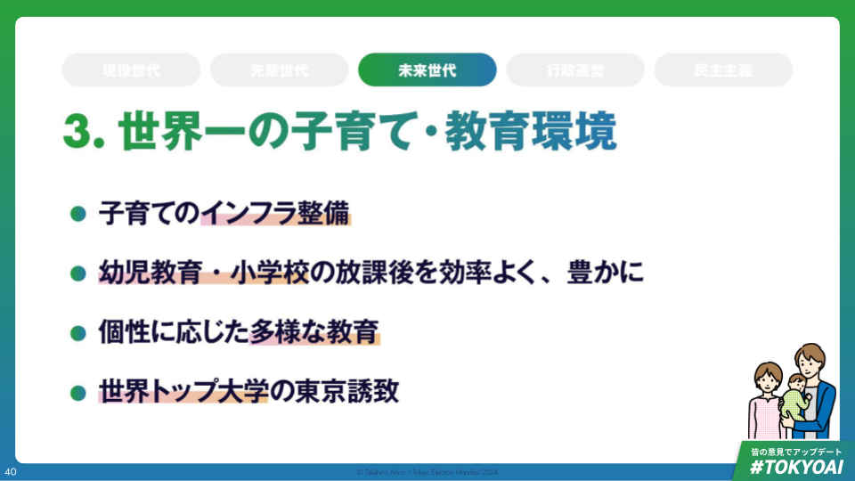

# 【未来世代】世界一の子育て・教育環境

## 世界一の子育て・教育環境の実現へ

- 出産
    - 課題は東京都の出生率0.99
        - 「子どもを産む、育てる」ことへの不安が強い
    - 重点テーマは出産・子育てのインフラの整備
    - 具体施策は不妊治療の促進、住宅費・教育費の支援
- 幼児・小学校
    - 課題は保育・学校外の学びの質向上
    - 重点テーマは幼児教育・小学校の放課後を効率よく、豊かに
    - 具体施策は新世代児童館の設置、学童・保育業務のDX・推進
- 中学・高校
    - 課題は一人ひとりに合わせた学びへのアクセス（大学研究室が才能ある中高生を受け入れ、共同研究を推進できる体制を整備する）
    - 重点テーマは個性に応じた多様な教育
    - 具体施策は学校内外の多様な学びの場の提供、教員の働き方改革とリスキリングの促進
- 大学
    - 課題は学術都市としてのポテンシャルを活かしきれていない
    - 重点テーマは世界トップ大学の東京誘致
    - 具体施策は海外一流大学のキャンパス誘致、都立大学でのデュアル・ディグリー制度（複数学位取得制度）の推進

## 東京都の少子化要因の多くが有配偶率の低下。有配偶者もより多くの子供を期待

- 東京都の合計特殊出生率は低迷。
    - 2023年についに1を下回った。
        - 2023年度の合計特殊出生率は0.99。
        - 2023年の出生者数86347人、前年比4750人減少。
- 東京都は全国に比べて有配偶率が非常に低い。
    - 有配偶率と有配偶出生率に要因分解すると、東京都は前者による押下げ要因が圧倒的に大きい。
- 夫婦の理想子供数と現存子供数には大きな差があり､理想実現に向けたサポート余地が存在。
    - 夫婦の理想子ども数の平均は2.25だが、実際の出生子ども数は1.73と乖離。

## ｢1人目の子供を持つ｣､｢3人以上の子供を持つ｣の2つの課題が存在

- ｢一人目が生まれない｣､｢金銭的負担が重たい｣が重要な課題
    - 一人目の子供を持たない理由の上位3位
        - 1位「欲しいけれどもできない」62%
        - 2位「高年齢出産の負担が重たい」23%
        - 3位「金銭的負担が重たい」18%
    - 子どもを3人欲しいが持たない理由の上位3位
        - 1位「金銭的負担が重たい」59%
        - 2位「高年齢出産の負担が重たい」42%
        - 3位「育児の負担が重たい」24%
- 東京23区では教育費がかかる。
    - 2023年は全国平均比で2.3倍。
        - 1世帯当たり教育費推移で見ると、全国平均が10446円なのに対して東京都23区では24160円と2.3倍もの開きがある

## 安心して子供を産み育てるための2つの支援

- 子どもが欲しい方に向けての支援
    - 自費で実施される「先進医療」に係る費用の助成額の上限を取り除く
    - 無痛分娩に対する助成などさらなる負担低減を広げていく
    - 不妊治療の夜間診療の拡充を図るなど、より多くの人が受診機会を得られるよう提言する
    - 不妊治療における物理的負担を軽減
        - 不妊治療に向けた休暇をとりやすい制度や柔軟な働き方の実現に向けて提言する
        - 通院回数を１回でも減らすため、不妊治療に必要な各種書類（戸籍謄本・同意書等）のオンライン提出や病院ごとの統一フォーマット推進
    - フリーランス・起業家など、育休が取れない方への支援も実施します。
- 子育ての経済的負担に向けての支援
    - 子育て世帯に向けて、家賃の一部を割引する制度を拡充します
    - 教育費（塾代・受験料）を支援する制度を整備します

## 不妊治療の3つの負担をサポートします

- 経済的負担
    - 不妊治療のうち、自費で実施される「先進医療」に係る費用の助成額の上限を取り除く
    - 無痛分娩に対する助成などさらなる負担を広げていく
    - フリーランスや起業家の方向けの出産手当金・出生時育児休業給付金を手配
- 時間的負担
    - 不妊治療の夜間診療の拡充を図るなど、より多くの人に受けられるように提言
- 心理的負担
    - 不妊治療に向けて非開示休暇をとりやすい制度や柔軟な働き方を取り入れるよう企業へ提言

## 子育てにかかる経済的負担への支援をより手厚く

- 住まいの費用
    - 既存政策では40歳代までの夫婦世帯の方に対して、市部の一部空家を対象に、入居から3年間、毎月の家賃を20％割引している（JKK東京｜ペアさぽ）
    - 我々の提案は、その優遇期間を第一子義務教育修了年限まで拡大
- 教育費用
    - 既存政策では中学3年生・高校3年生（またはこれに準ずる者）を対象に塾費用や受験料の無利子での貸付
        - 東京都社会福祉協議会による受験生チャレンジ支援貸付事業
        - 018サポートや、第二子の保育料無償化
    - 我々の提案は、以下の支援を通して教育費を支援する
        - 民間の教育費負担（塾代や課外活動など）に対する教育バウチャー（5000円/月）を配布
            - 中学3年生・高校3年生（またはこれに準ずる者）を対象とする
        - 高校受験料を支援
        - 第一子保育料を無償化する
        - 018サポートなど、現存する支援策は踏襲する

## 保育・学童クラブでは、量より質の議論へ

- 保育所の待機児童数はここ数年で大幅に減少した
    - 平成30年度5414人から令和5年286人
- 一方で、質はまだまだ改善の余地がある
    - 「子ども」の体験の向上
        - 世界の子どもたちの放課後体験は更に充実
    - 「保育・学童で働く方」の体験の向上
        - 東京都で働く保育士の方のうち、40.1%が「事務、雑務の軽減」を希望。60%超が「特別な支援を必要とする子どもへの接し方」「発達心理学」「実技」をより学びたいと回答

## 幼児教育・小学校の放課後を効率よく、豊かに

- STEAM活動（Science、Technology、Engineering、Art、Mathematics）に触れられる新世代児童館の設置
    - 児童館等、子どもの放課後施設でSTEAM活動に触れられるようなハード（3Dプリンターなど）・ソフト（コンテンツ・スタッフ）を整備し児童生徒がテクノロジーに触れられる環境を作る。
    - 基礎自治体が新世代児童館に拡充する際に助成し、転換を促進する
- 学童・保育業務のDX推進
    - 学童・保育業務の中で共通してDX化できる部分のDX化支援を都が行う（情報発信プラットフォームの共通化など）
    - 保護者向け子育て講座など、必ずカバーする必要があるものについては都でフォーマット化し、各区・施設の負担を軽減する
    - 効率化された時間を用いて学童・保育スタッフが「子どもに向き合う」時間とスキルの質を高める

## 最先端の学びに触れられる機会を作る

- 海外・国内ともでは英国・米国では子どもが最先端テクノロジーに触れられる公設機関が存在
    - 国・自治体とハイテク企業･財団が開設した、最先端の科学が学べる幼稚園・放課後学習支援施設が存在（米国・英国など）
    - 日本国内でも、子どもが放課後に最新のテクノロジーに触れられる公設民営型施設が存在（石川県加賀町・徳島県松茂町など）
- STEAM活動に触れられるハードを設置し、企業連携から良質なコンテンツを集めていく
    - 最先端のハード、社会資源へのアクセス、良質なコンテンツを揃える

## 多様な学びの選択肢へのニーズは広がっているが、親の負担や情報不足から十分にリーチしていない

- 小・中学校における不登校児童数は30万人に迫る勢い。現時点でも公教育の学び方にあっていないお子さんが増えてきている
    - 2022年度の実績で不登校児童・生徒数は299048人で全体の3.2%
- 校外の学びの機会に参加しなかった割合が多く、保護者が関わらなくてよいプログラムの充実と情報格差が課題に
    - 公的機関が行う行事への参加状況として、「参加しなかったが全体の46.8%
    - 参加しなかった理由は「子どもが関心を示さないから」が34.3%で1位だが次いで「保護者などの時間的負担が大きいから」が24.3%、「団体や行事などがあることを知らないから」が16.8%だった

## STEAMへの就職・進路にはいまだにジェンダーバイアスが強く働いている

- ITエンジニアとして働く就業者のうち、女性が占める比率を集計したところ、OECD加盟国の平均を割り、下位に低迷
    - ITエンジニアにおける女性比率は日本は16.90%に留まる
- 男女間での分野別の進学の偏りは改善しつつも残存、女性比率は理工系を中心に低水準
    - 分野別大学入学者における女性比率を理工系分野について比較すると、2003年から2023年にかけて改善はしているが未だ低い
        - 工学は10.6%が16.1%に
        - 理学は25.8%が27.9%に
        - 農学は41.3%が46.1%に
        - 医歯薬は43.5%が50.1%に

## 教員の働き方改革とリスキリングを並行して進める必要

- 教員の1週間あたりの勤務時間は引き続き長く、国の残業上限を超える層が大半を占める
- 教員のICT活用指導力には自己評価でもまだ伸び代があることが判明しており、リスキリングの機会が求められている

## 個性に応じた多様な教育を推進

- 学校内外の多様な学びの場の支援
    - ジェンダーに関わらず学びたいことを学べるようになるための支援
    - STEAM教育を根幹に据えた学校を公立の中高一貫校として設置
    - 一部は「学びの多様化校」として設置して、より幅広いニーズに対応する
    - 学校外の学びを検索できるプラットフォームを作る
- 教員の働き方改革とリスキリングの促進
    - 校務DXを進めて業務改善を図る
    - 先端教育実践校による研修など、教員のリスキリングを実施
    - 教員採用試験の問題を改訂し、これからの時代にあったものに変えていく

## 多様な学びへのアクセスを広めるために幅広くアプローチ

- 構造・仕組みへのアプローチ
    - ジェンダーに関わらず学びたいことを学べるようになるための支援を促進。特に、文理決定前に注力する
    - 小学生・中学生向け職業体験（日本版Girls'Day）実施
    - 校外での学びプログラムを、関心や認知特性に合わせてマッチングするプラットフォームを設立
    - 体験格差を助長しないためのバウチャー制度を検討
- 学びの内容・コンテンツへのアプローチ
    - 大学等で提供される先取りプログラム（AP|Advanced Placement）に対して、都立高校で受講を推奨・支援する（大学進学後には単位認定）
    - NPOなど多様な講座提供も促進
    - 先端的STEAM教育を実践する実験校を設置する
    - 学びの多様化校の仕組みを活用し、多様な特性の生徒が通学できるようにする

## 学びの担い手である教員の働き方改革とリスキリングの促進

- 校務DX
    - 家庭との連携や校内業務、採点・成績管理をDX推進する
    - 校務系・学習系のネットワークの統合を促進
- リスキリング
    - 海外の最先端教育メソッドを派遣／招聘して学べる機会づくり
    - 教員のネットワークを、多様な学びの担い手にも開き、公教育・民間教育での知見交流を活性化する
- 教師採用試験のアップデート
    - これからの教師の求められている人物像に合わせて、試験問題を改訂する
    - ICT機器、AIを活用可とする試験形式や、探究学習の要素を導入

## 東京は学術都市としてポテンシャルがある

- QS Best Student Cities 2024において、ロンドンについで学生にとって生活しやすい街として2位にランキング
- 世界の都市総合力ランキングでの「研究・開発」部門では4位に位置する

## 東京をグローバルな知の還流拠点とする

- 海外一流大学のキャンパス誘致
    - ニューヨーク大学はアブダビ（アラブ首長国連邦）・上海に分校を設置
    - イェール大学はシンガポール国立大学と共同で「Yale-NUS大学」を設立（ただし2025年に閉校予定）
    - 都知事のリーダーシップのもと、キャンパス誘致を強化
- 都立大学でのデュアル・ディグリー制度（複数学位取得制度）の推進
    - 東京都立大学と海外大学との共通単位を実現していく
        - 日本と海外の両方の学位を、それぞれ個別に取得するよりも短い期間で取得できるプログラム
        - 海外大学の学生が東京都立大学の学位取得のため東京に訪れる機会を創出し、人材交流を図れる
    - 大学間のネットワークの拠点となる

## 妊婦へのRSウイルスワクチンの公費助成

- 乳児にとってRSウイルスは脅威
    - RSウイルスは生後1歳までに50％以上、2歳までにほぼ100％がRSウイルスに感染する
    - ある程度成長した子供や大人にとっては咳がしつこい風邪程度で済むが、特に生後6ヶ月までの乳児が罹患すると重症化の可能性がある
    - 重症化すると気管支炎、肺炎、無呼吸、急性脳症などを起こすことがあり、最悪の場合死に至る
- 母子免疫ワクチンの効果
    - 2024年5月末より、妊婦が接種することで胎児に抗体が移行するワクチン「アブリスボ」が登場
    - 第Ⅲ相試験において、ワクチンの有効性は、重度のRSウイルス関連下気道感染症に対して、生後90日で81.8%、生後180日で69.4%となっている
    - 有害事象および重篤な有害事象はワクチン群とプラセボ群で同程度
    - 総合的に見て、基礎疾患のない乳児に対するRSウイルスの予防に寄与するとの日本小児科学会の見解
- 接種費用の壁
    - 任意接種のため、30,000円～の個人負担が発生する
    - 接種したくても価格面の懸念から接種を断念するケースもあり、公費による助成の必要性がある
