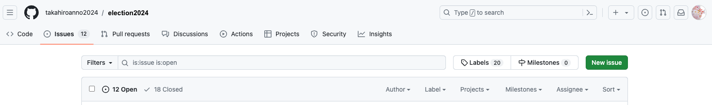

# 課題提起（Issue・イシュー）マニュアル

<h2 id="new_issue">新しいイシューの立て方</h2>

### サインイン

[GitHub](https://github.com/)にサインインします。 アカウントを持っていない場合はアカウントを作成します。

### Issuesにアクセス

[https://github.com/takahiroanno2024/election2024/issues](https://github.com/takahiroanno2024/election2024/issues) にアクセスします。  

### Issue作成画面

**New Issue**をクリックして、

テンプレート画面の**Get started**をさらにクリックします。

<h2 id="comment_issue">イシューへのコメント</h2>

### コメントを作成

テンプレートに沿って、コメントを作成します。  
**提出後も内容を編集することができます。Preview**タブをクリックすると提出した際の見え方を確認することができます。  

## コメント提出

コメントを作成したら**Submit new issue**をクリックします。  

## 提出完了

コメントした内容がGitHub上に反映されます。
