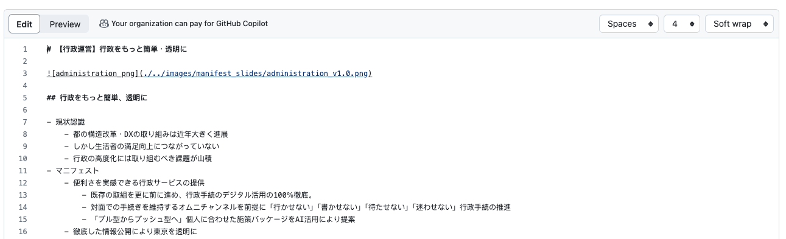

# 変更提案（Pull Request・プルリクエスト）マニュアル

1. 修正したい政策ファイルを一つ選択してください。

2. 右上の鉛筆ボタンを押してください。

3. 「Fork this repository」ボタンを押してください

4. エディタに変わるので、そのまま修正をしてください。

5. 必要な修正をしたら、修正内容を入れて`Propose changes` ボタンを押してください。
6. 内容を確認し、`Create pull request` を押してください。
7. 変更内容を再度確認し、`Create pull request` を押してください。
以上で完了です。
